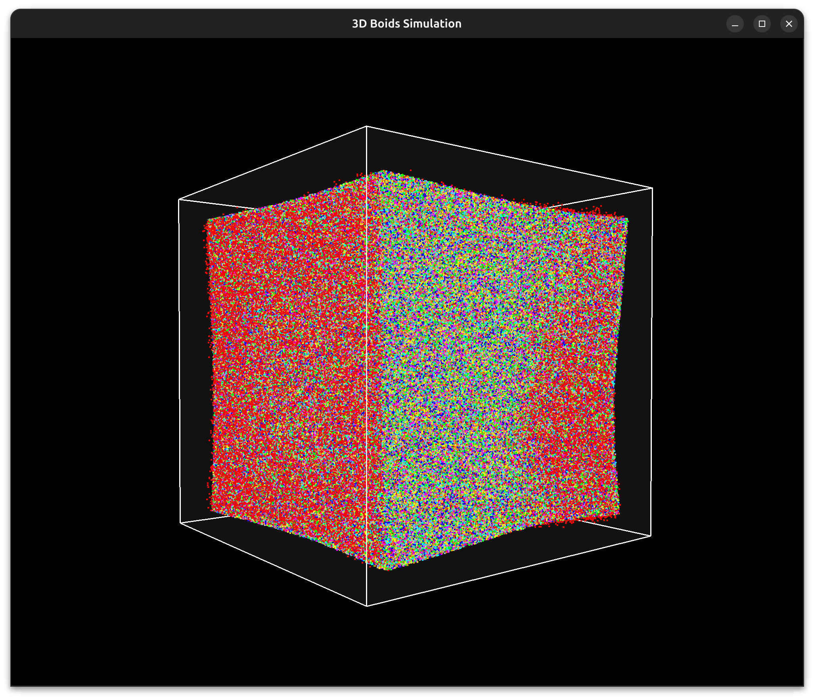
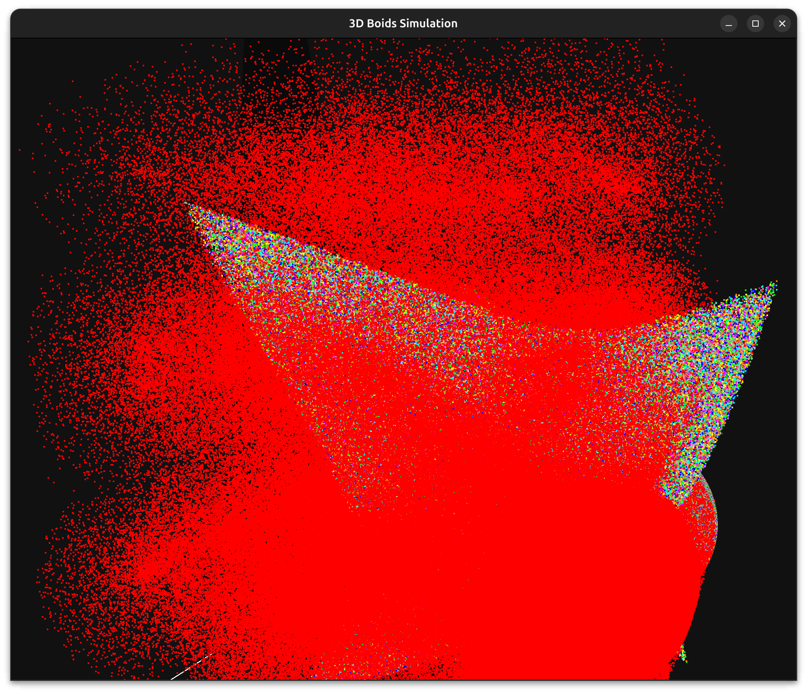

# Boids — GPU-accelerated flocking demo

This is a simple Boids (flocking) simulation and renderer using OpenGL. The project includes
both a CPU fallback and a GPU compute-shader path (SSBO-based) for updating boid positions.

## Features

- GPU compute path using GLSL compute shaders (requires OpenGL 4.3+)
- CPU fallback with a spatial grid and OpenMP parallelization
- Per-boid colors, adjustable point size, and a translucent boundary cube
- Auto-scaling of simulation bounds based on boid count

## Gallery

Left: a dense cube of boids colored by groups. Right: a closer view showing a slice through the flock.






## Requirements

- CMake (>= 3.10)
- A C++17-capable compiler (g++/clang++)
- OpenGL and development headers
- freeglut (or GLUT), GLEW
- Optional: OpenMP for faster CPU fallback

On Debian/Ubuntu these packages will satisfy the dependencies:

```bash
sudo apt update
sudo apt install build-essential cmake libgl1-mesa-dev libglu1-mesa-dev freeglut3-dev libglew-dev
```

If you want OpenMP support (recommended for CPU fallback):

```bash
sudo apt install libomp-dev
```

## Build

From the project root:

```bash
mkdir -p build && cd build
cmake ..
cmake --build . -- -j$(nproc)
```

This produces the `boids` executable in `build/`.

## Run

Run from the project root or `build/` directory:

```bash
./build/boids
```

Notes:

- The GPU compute path requires an OpenGL 4.3+ capable driver. If your GPU/driver doesn't
 support compute shaders, the application falls back to a CPU implementation.
- To change the number of boids, edit `NUM_BOIDS` in `main.cpp` (compile-time) or add a
 runtime option if desired.

## Troubleshooting

- CMake fails to find GLUT / GLEW: ensure the development packages above are installed.
- Shader compile errors: check your GPU driver supports the GLSL version used in
 `main.cpp` (compute shaders require GLSL 4.30+).
- If the app is slow with many boids, consider enabling GPU compute (modern GPU),
 or reduce `NUM_BOIDS` / enable OpenMP.


## License

MIT License — see `LICENSE` (not included).
